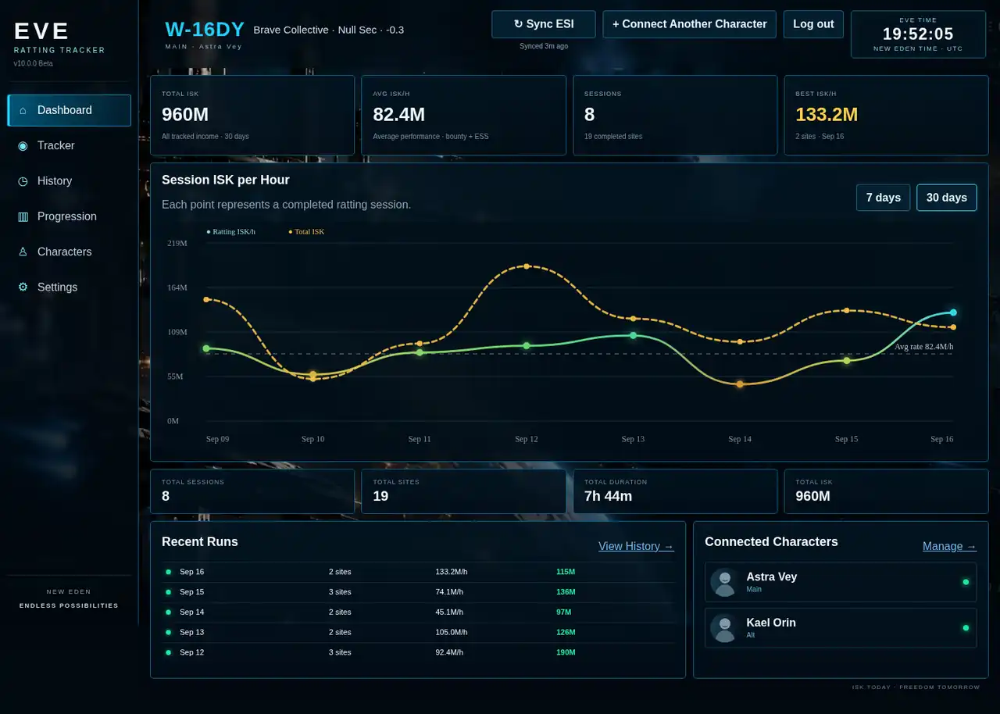
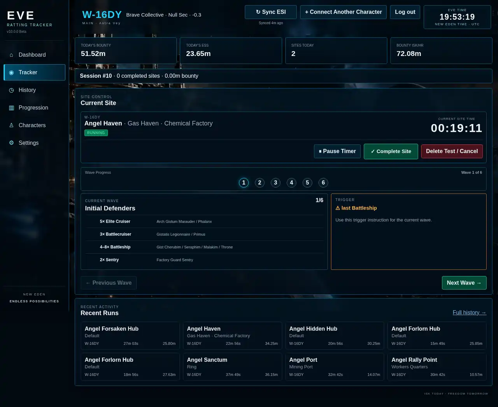
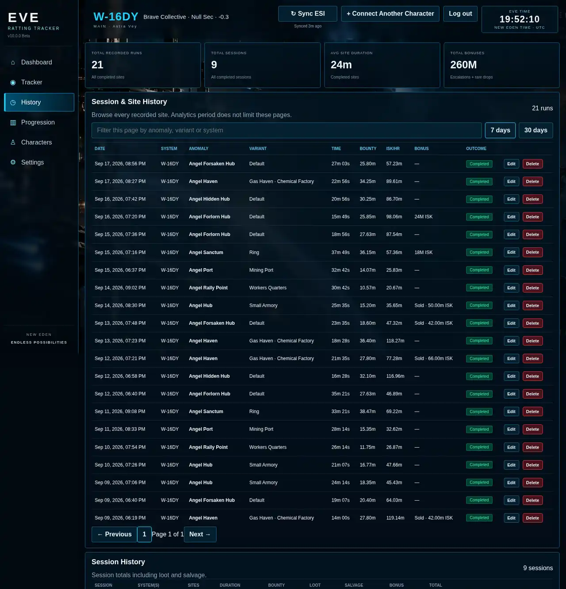

# EVE Ratting Tracker

A web-based tracker for EVE Online ratting sessions. It combines a live site timer and site helper with ESI data so you can keep track of **bounties, ESS payouts, loot, salvage, escalations, rare spawns, session performance, and ISK per hour** across one or multiple characters.

**Live tracker:** https://eve-ratting-tracker.onrender.com

The tracker is designed to stay useful even when ESI is delayed or temporarily unavailable: site timing and manual results are saved first, while ESI synchronization catches up separately.

## Screenshots

### Performance Dashboard

Review session income, average ratting ISK/h, best sessions, recent activity, and connected characters.

### Live Site Tracker

Choose the site and variant, track the active timer, and use the wave/trigger helper while running the anomaly.

### History

Browse completed sites and sessions, including duration, bounty, ISK/h, bonuses, loot, salvage, ESS payments, escalations, and rare-spawn results.

> The screenshots above use fictional characters and generated demo values. No real player or account data is shown.

## Main Features

- **EVE SSO / ESI integration** for character data, wallet activity, bounty information, ESS payouts, location, ship information, skills, and training queue.
- **Multiple characters** under the same tracker account, with one character designated as Main.
- **Site timer** with pause/resume support and immediate local saving.
- **Site and variant selection** with an Angel Cartel anomaly catalog covering the available anomaly tiers.
- **Wave and trigger helper** for supported sites, including site-specific variants where applicable.
- **Session tracking** so multiple sites can be grouped into one ratting session.
- **Income tracking** for bounty, ESS, loot, salvage, sold escalations, escalations run personally, and commander/rare-spawn drops.
- **Performance dashboard** with session totals, averages, ISK/h trends, recent runs, and best-session performance.
- **History** with detailed site/session records and editable results.
- **Progression statistics** for site performance, escalation rates, rare spawns, milestones, character SP, and training queue information.
- **Background ESI synchronization** so an ESI delay does not stop the active tracker.

## How to Use

1. Open the tracker and **Log in with EVE Online**.
2. Use **Connect Another Character** if you want to track additional characters on the same account.
3. In **Characters**, choose which connected character should be your **Main**.
4. Open **Tracker** and select the site, variant, and participating character(s).
5. Press **Start Site** when you begin the site. The timer starts immediately.
6. Follow the **wave composition and trigger helper** when the selected site has confirmed helper data.
7. When the site is finished, press **Complete Site** and record any escalation, rare spawn, or other result that applies.
8. When you are finished ratting, end the session and add any **loot or salvage** collected during that session.
9. Use **Sync ESI** when needed. Bounty and ESS information is matched to your tracked activity as ESI data becomes available.
10. Review your results in **Dashboard**, **History**, and **Progression**.

## Understanding the Income Numbers

**Ratting ISK/h** measures the ratting performance itself using **Bounty + ESS** over the tracked site time.

**Total ISK** represents the actual recorded session income and can also include **loot, salvage, rare drops, and realized escalation value**.

For escalations:

- **Sold** counts the sale value as realized income.
- **Ran Myself** counts the recorded escalation loot value as realized income.
- Pending/unrealized escalations do not inflate the income totals.

## Site Helper Notes

The site helper only shows wave/trigger information that has been added to the tracker. Some sites have multiple layouts or variants, while others use a single standard layout.

When a variant can be identified directly from EVE's site information, the tracker may show a short hint under the variant selector. For example, **Angel Haven's Rock Haven / Pirate Gate** can be identified by its warp-in popup.

---

This is a community EVE Online tracking project. EVE Online and all related trademarks are the property of CCP hf.
